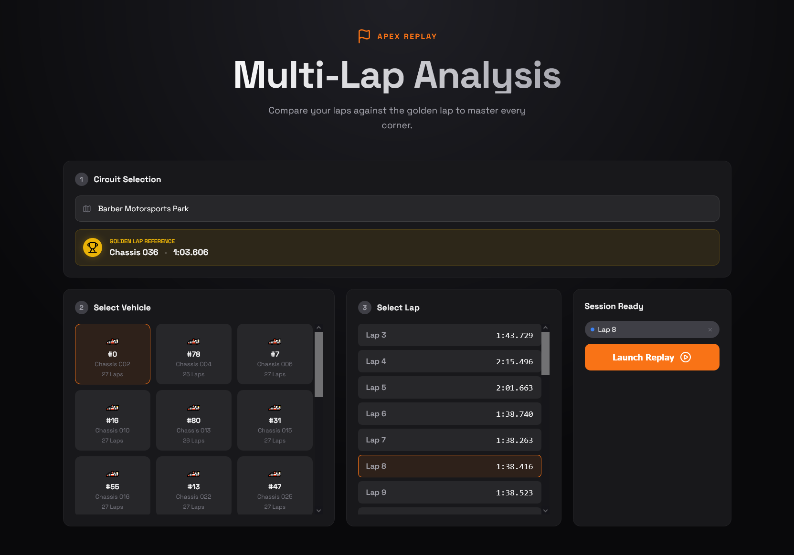

# Apex Replay 🏁



Apex Replay is an end-to-end telemetry and AI coaching platform that helps Toyota GR Cup drivers compare their laps to a “golden” reference, visualize pace gaps, and receive targeted recommendations generated by Gemini 2.5 Pro.

This repository contains both the FastAPI backend (data processing, AI insights, telemetry APIs) and the vanilla JS/Tailwind frontend (circuit maps, charts, coaching dashboard).

## Highlights

- Sector-level comparison, consistency scoring, and AI-generated advice
- **Curated Datasets**: Includes enriched telemetry for **Barber** and **Indianapolis** circuits
- Automatic CSV → Parquet conversion for efficient data loading
- Rich visualizations: multi-lap replay, speed flow analysis, consistency tracking, lap progression, speed trace, timeline
- Designed for deployment on **Firebase Hosting** (frontend) and **Google Cloud Run** (backend). No external DB/File services are required—the processed dataset lives in the repo.

## Documentation

| Document | Description |
| --- | --- |
| [`README.md`](README.md) | Project summary, quick start, stack overview |
| [`docs/project-overview.md`](docs/project-overview.md) | In-depth product & technical documentation (architecture, data processing, hosting plan, screenshots, diagrams) |
| [`docs/user-guide.md`](docs/user-guide.md) | Step-by-step instructions for running the platform, selecting laps, and interpreting every view |

## Interface Preview

| | |
| --- | --- |
|  |  |
|  |  |

### Motion Preview

> 🎞️ Comparison Mode walkthrough — see the ghost cars, highlighted segments, and tooltip interactions in motion.

## Tech Stack & Hosting

- **Frontend**: HTML5, Tailwind CSS, vanilla JavaScript (D3, Chart.js), Firebase Hosting
- **Backend**: Python 3.11, FastAPI, Pandas, NumPy, Uvicorn, Google Cloud Run
- **Data processing**: automatic CSV ingestion, Parquet export, telemetry caching; structured to keep datasets inside the repository (`/data`)
- **AI**: Gemini 2.5 Pro for natural-language coaching insights

### Architecture at a Glance

- Drop raw CSV bundles under `data/<Circuit>/<files>.csv`.
- `RaceDataProcessor` (backend) converts them to Parquet at boot, caches lap events, and exposes REST endpoints.
- Frontend fetches `/api/circuits`, `/api/vehicles`, `/api/analysis` to render maps/charts.
- Gemini 2.5 Pro receives serialized comparison payloads and returns coaching text.
- Hosting: Firebase for the static UI; Cloud Run for the FastAPI container (no database required, dataset travels with the image).

## Project Structure

```
├── backend/               # FastAPI app + services
├── frontend/              # Static UI (index.html + JS/CSS)
├── data/                  # Telemetry CSV/Parquet folders (auto-discovered)
├── docs/                  # Documentation + media assets
└── README.md
```

## Getting Started

### Prerequisites

- Python 3.11+
- Node.js 18+ (for Tailwind build / Firebase CLI)
- (Optional) Firebase CLI & Google Cloud SDK for deployment

### 1. Backend

```bash
cd backend
python -m venv venv
source venv/bin/activate           # Windows: venv\Scripts\activate
pip install -r requirements.txt
python3 main.py                    # runs uvicorn main:app with reload
```

The server will automatically:
1. Scan `/data/**`
2. Convert any matching CSV files to Parquet (telemetry, lap_start, lap_end, lap_time)
3. Cache lap events, lap times, and vehicle lists

### 2. Frontend

```bash
cd frontend
python -m http.server 3000         # or serve via your preferred static server
```

Open http://localhost:3000 (frontend) and ensure the backend is reachable at http://localhost:8000.

### 3. Environment Variables (optional)

```bash
export GEMINI_API_KEY=your_key_here     # enable AI Insight
export GEMINI_MODEL=gemini-2.5-pro      # or gemini-2.5-flash
```

### 4. Dataset

Organize circuit data under `data/{Circuit Name}/...` following the existing folders (e.g., `barber`, `indianapolis`, `COTA Race 1`). The backend automatically discovers races and lap files via regex patterns, so heterogeneous naming conventions (e.g., `vir_lap_start_R2.csv`, `sebring_telemetry_R1.csv`) work out of the box.

> 📦 **Efficiency**: The dataset is automatically converted to Parquet format for fast loading and efficient storage within the container.

## Deployment

- **Frontend** → Firebase Hosting (`firebase deploy --only hosting`)
- **Backend** → Cloud Run (`gcloud run deploy apex-replay-api ...`)

No database is required; copy the processed `data/` folder into the container image or mount it from Cloud Storage (documented in `docs/project-overview.md`).

## Contributing

1. Fork & clone the repository
2. Create a branch: `git checkout -b feat/my-feature`
3. Run the lint/test suite (if applicable)
4. Submit a PR with screenshots of new UI changes

## License

MIT — see `LICENSE` for details.

---

Built with ❤️ for drivers chasing their next tenth. 🏁
