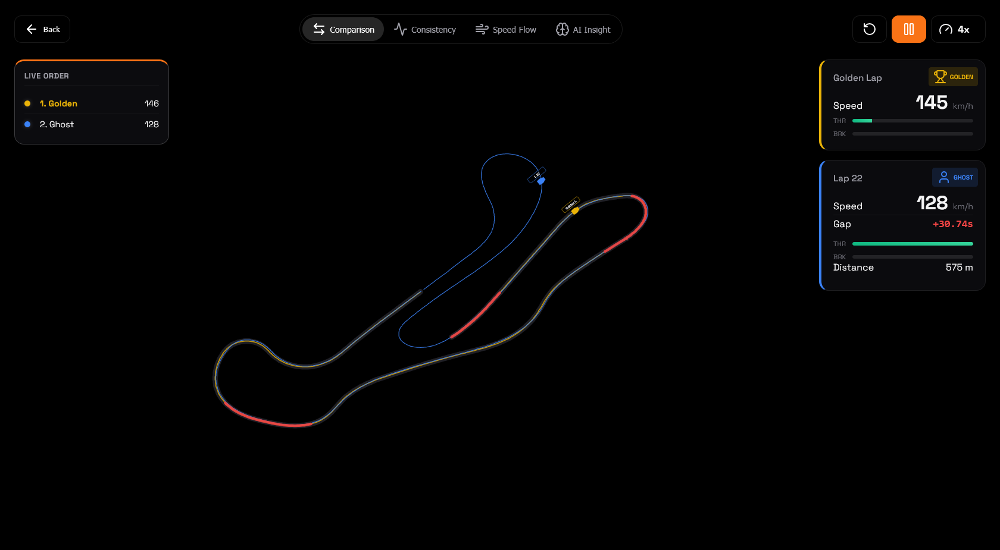
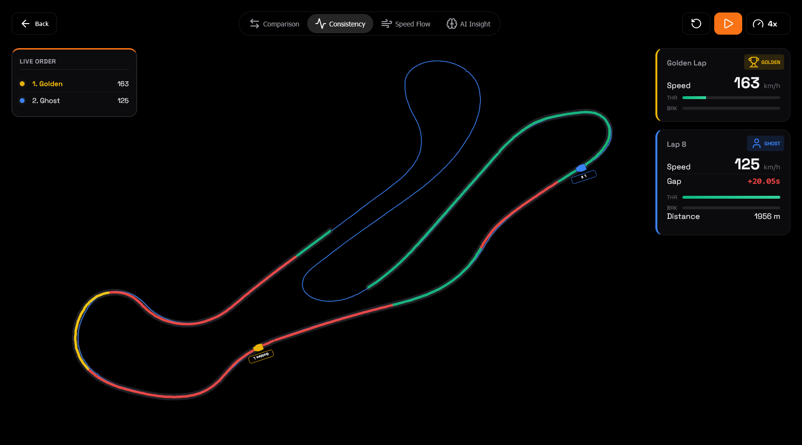
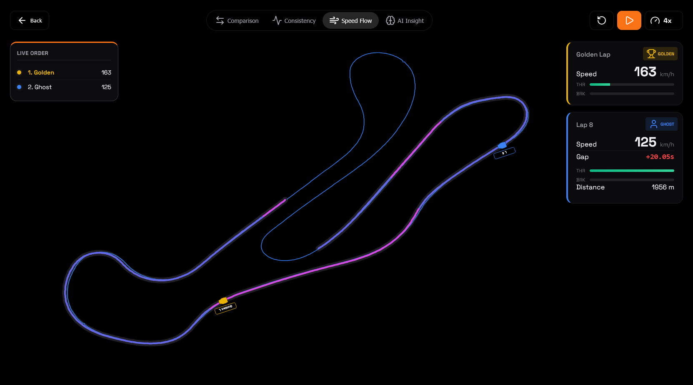
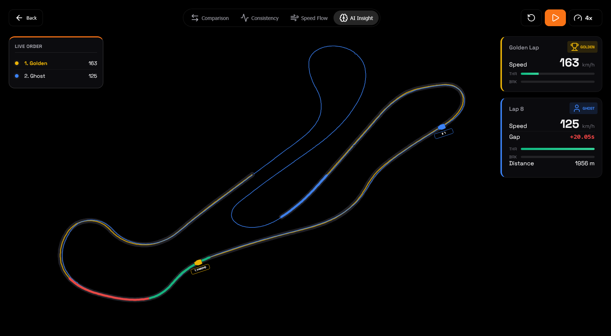

# Apex Replay — User Guide

This guide walks through running the platform locally, uploading new circuits, and exploring every UI view. For architectural details, see [`docs/project-overview.md`](project-overview.md).

## 1. Run the Platform Locally

1. **Start the backend**
   ```bash
   cd backend
   python -m venv venv
   source venv/bin/activate
   pip install -r requirements.txt
   uvicorn main:app --reload --port 8000
   ```
   The server scans `/data/**`, converts CSVs to Parquet, and exposes REST endpoints at `http://localhost:8000`.

2. **Start the frontend**
   ```bash
   cd frontend
   python -m http.server 3000
   ```
   Open http://localhost:3000. The UI automatically calls the backend API running on port 8000.

3. **(Optional) Enable AI Insight**
   ```bash
   export GEMINI_API_KEY=your_key
   export GEMINI_MODEL=gemini-2.5-pro
   ```

## 2. Dataset Management

The platform comes pre-loaded with enriched telemetry for **Barber** and **Indianapolis**. These datasets are curated to provide the best experience for multi-lap analysis.

## 3. Walkthrough of the Interface

### 3.1 Landing & Selections

| Screen | Description |
| --- | --- |
| Vehicle selection | Select a circuit (Barber or Indianapolis), then browse vehicles in paginated tiles (🟦 indicates active selection) |
| Lap selection | Choose the lap you want to analyze; delta vs golden lap is displayed on each card |

### 3.2 Track Insight Maps

| Tab | Visual |
| --- | --- |
| Comparison (default) |  — ghost markers animate along the circuit, highlighting improvement segments |
| Consistency |  — segments colored by variance, hover for tooltips |
| Speed Flow |  — shows momentum along the lap with detailed tooltips |

Hold the mouse over a highlighted segment to read detailed instructions; right above the map, the legend explains every color.

### 3.3 Coaching Tabs

| Tab | Visual |
| --- | --- |
| 🤖 AI Insight |  — Gemini summary + tips. Requires `GEMINI_API_KEY`. |

### 3.4 Analytics Charts

| Chart | Visual |
| --- | --- |
| Speed trace | Speed trace graph |
| Lap progression | Lap progression graph |
| Hot-zone variance | Hot-zone variance graph |
| Race timeline | Race timeline graph |

Each chart tab shows informative empty states when data is missing (e.g., insufficient laps). Hover to see raw values.

## 4. Workflow Tips

- **Resetting the view**: Use the “Reset view” button above the maps to re-center/zoom.
- **Lap replay**: Press “Play” to animate the comparison markers; hit the same button again to pause.
- **Consistency insights**: The Consistency tab explains whether deviations are “Excellent”, “Balanced”, or “Weak” with emoji-coded rows.

## 5. Sharing & Hosting

- Deploy the frontend via `firebase deploy --only hosting`.
- Containerize the backend (Dockerfile in `backend/`) and deploy to Cloud Run with the `data/` folder included.
- Provide stakeholders with the GIF or video for demos.

---

Need more detail on the architecture or data pipeline? See [`docs/project-overview.md`](project-overview.md).
